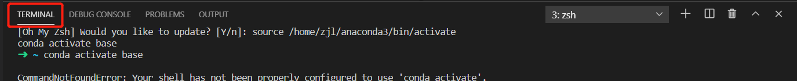
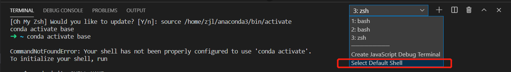
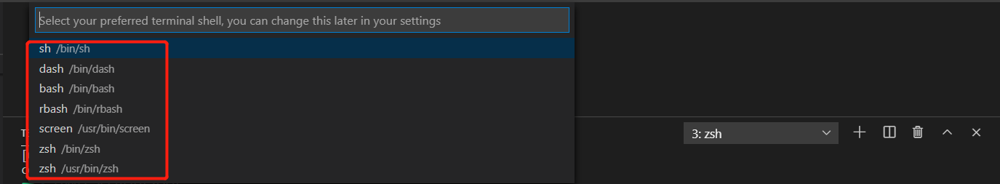
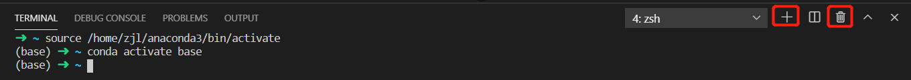

# oh-my-zsh  

## 一、安装zsh

- yum：

  - ```shell
    yum -y install zsh
    ```

## 二、使用zsh

- 查看：

  - ```shell
    # 当前使用shell：
    echo $SHELL    
    
    # 已安装的shell:
    cat /etc/shells
    ```

- 切换:

  - ```shell
    # 切换想要使用的shell:
    chsh -s /bin/zsh
    chsh -s /bin/bash
    重启 shell
    ```

  - vs code切换
  
    - cltr + ` 唤出 底部菜单栏，选择TERMINAL
      - 
    - 点击右边的下拉栏，选择 select default bash
      - 
    - 选择需要的shell即可
      - 
    - 点击右边 + 号，即可以另外打开一个shell，点击垃圾桶，即删除当前的shell，点击书本，即分栏
      - 

## 三、配置zsh

- 配置zsh：

  - ```shell
    # 打开配置文件
    vim ~/.zshrc
    
    # 主题选择
    ZSH_THEME=random
    ```

- 更新zsh：

  - ```shell
    source ~/.zshrc
    ```

## 四、更多配置：

https://www.jianshu.com/p/d372ef933453